# LANCH - Arquitetura do Sistema

Diagramas e documentação da arquitetura do sistema LANCH.

## 📐 Visão Geral da Arquitetura

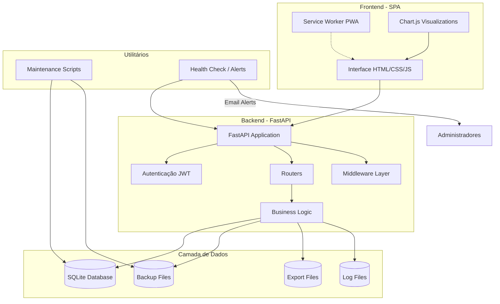

## 🏗️ Arquitetura em Camadas

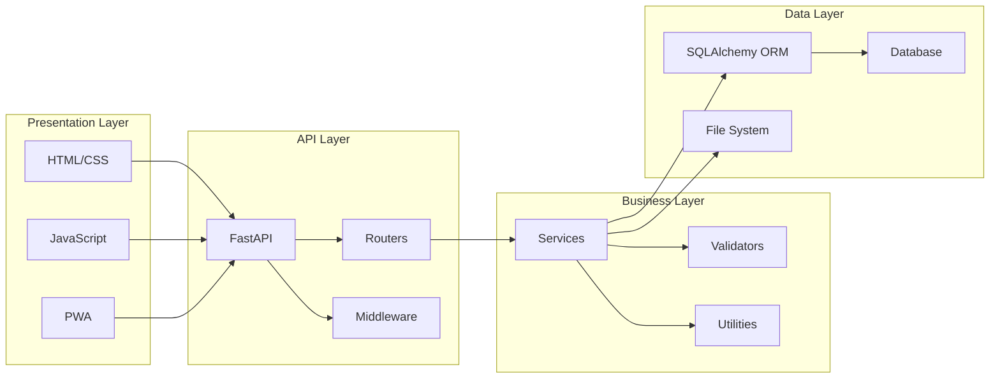

## 📊 Fluxo de Autenticação

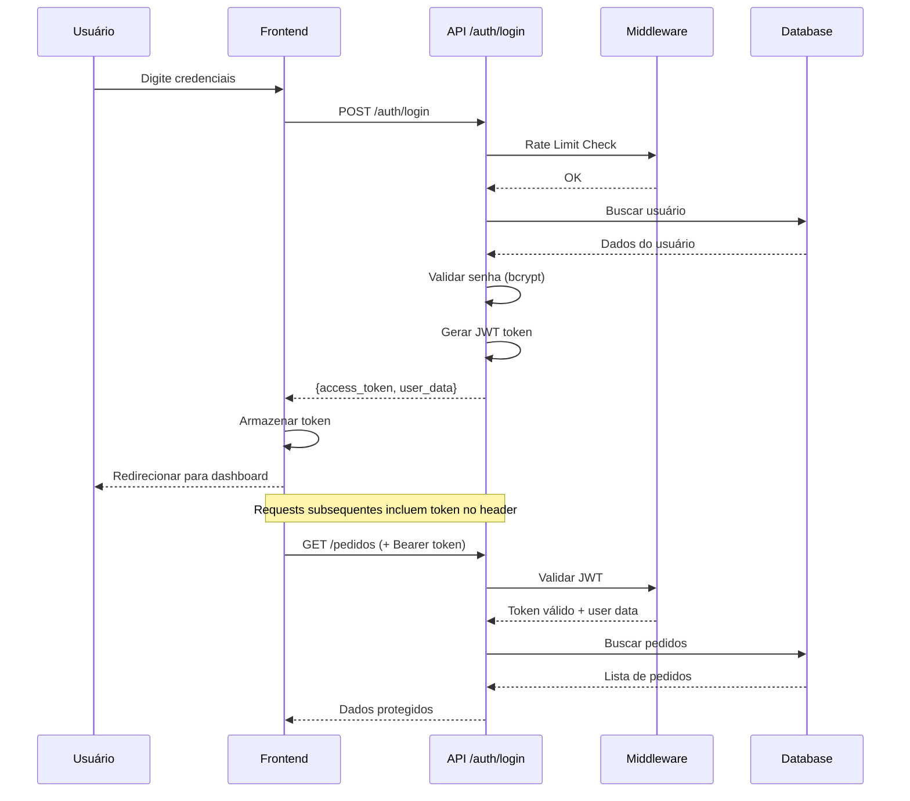

## 🛒 Fluxo de Criação de Pedido

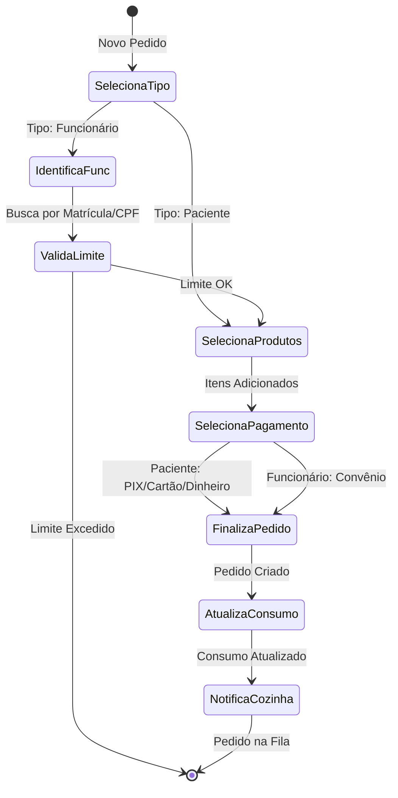

## 🔄 Fluxo de Status do Pedido (Cozinha)

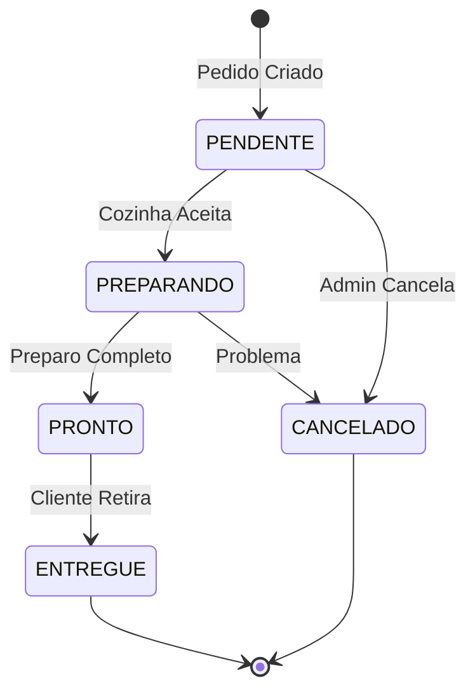

## 💾 Arquitetura de Backup

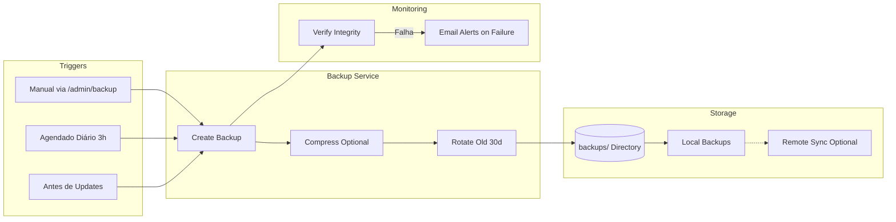

## 🗄️ Modelo de Dados Simplificado

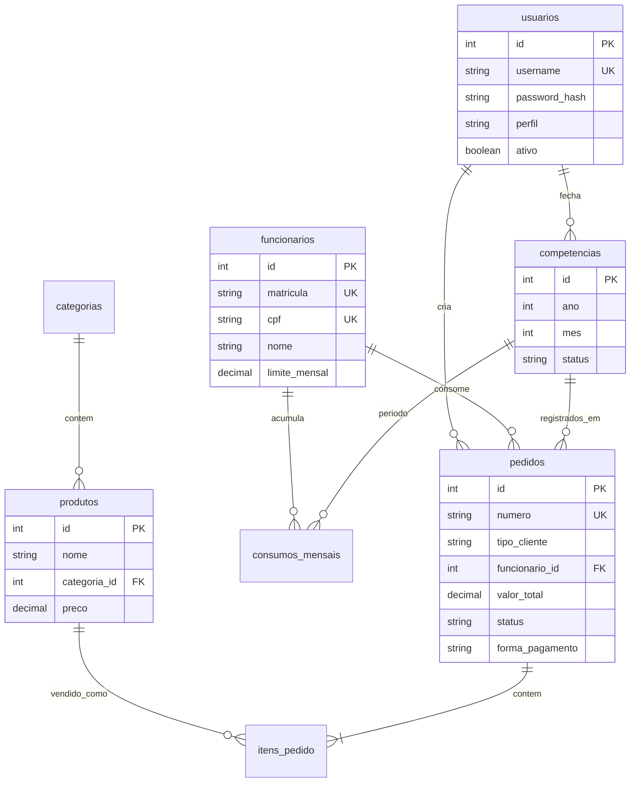

## 🔐 Camadas de Segurança

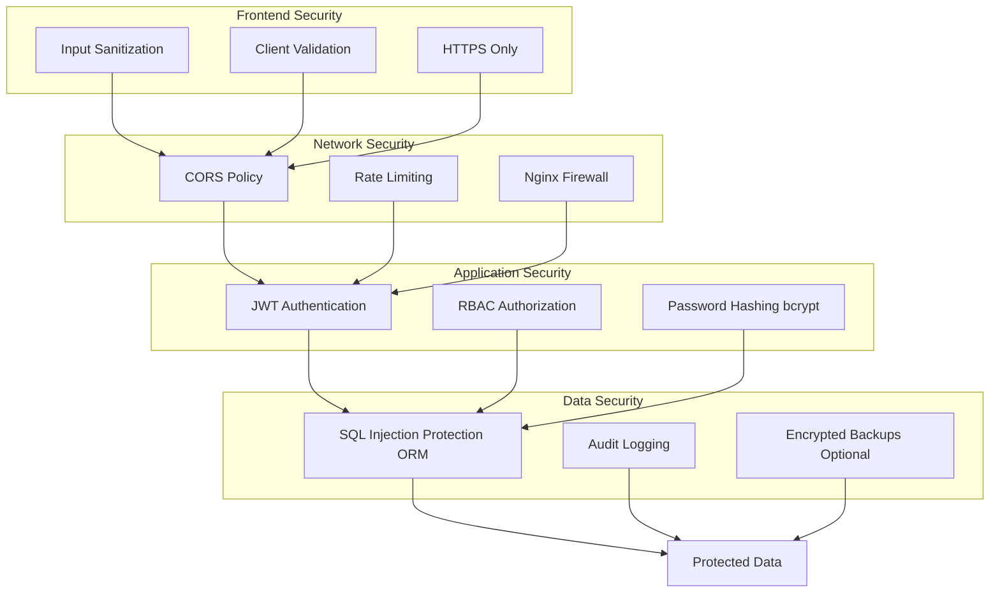

## 📈 Fluxo de Monitoramento

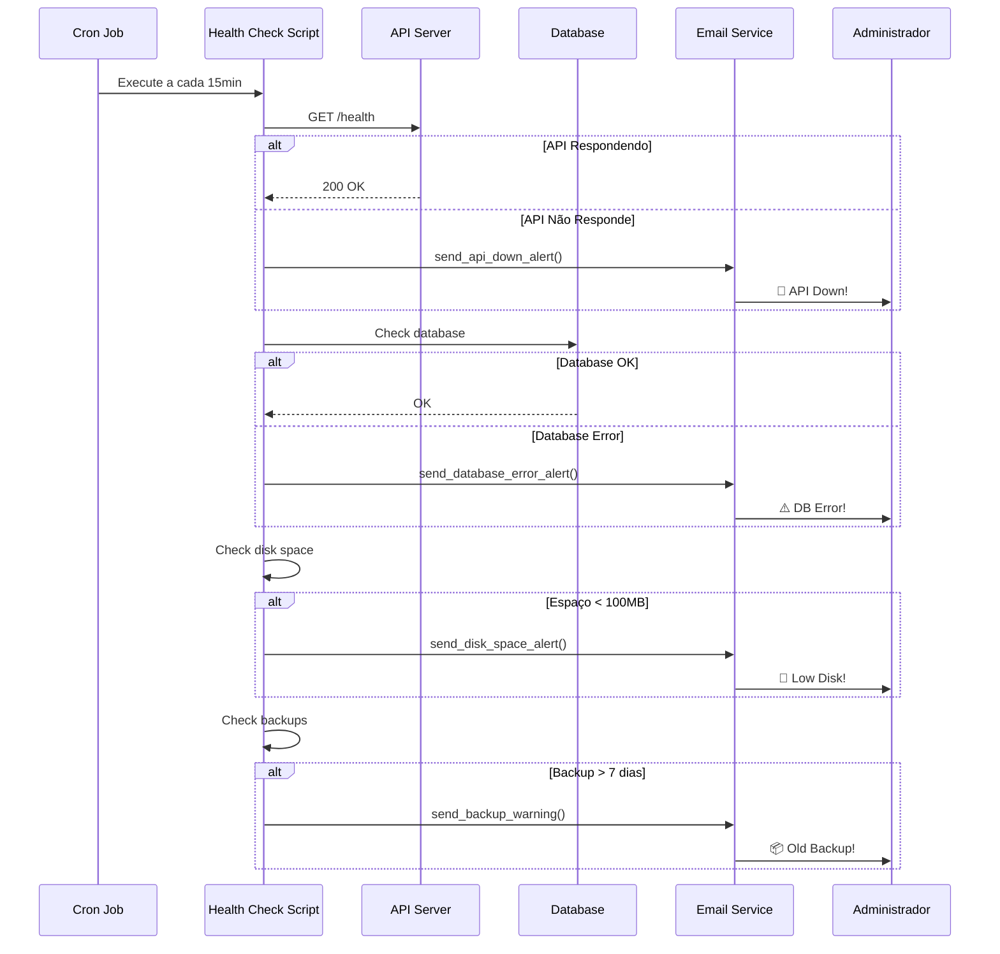

## 🌐 Deploy Architecture (Produção)

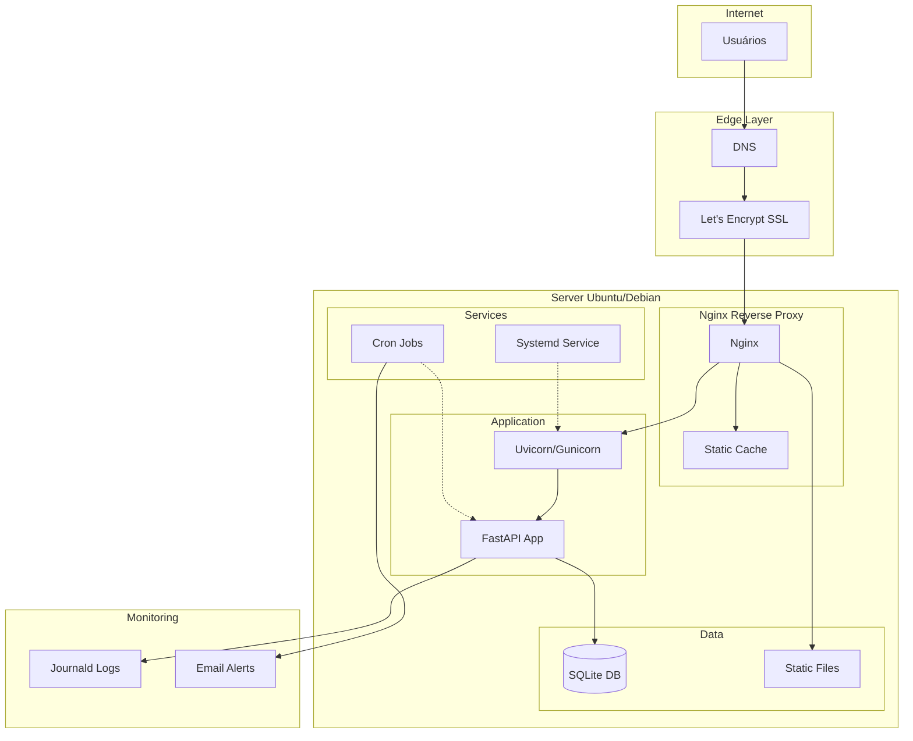

## 🔄 CI/CD Flow (Recomendado)

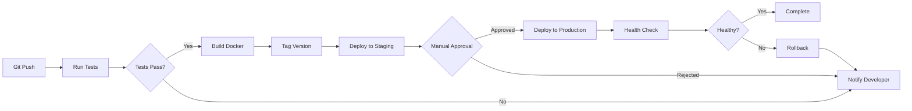

## 📱 Progressive Web App (PWA)

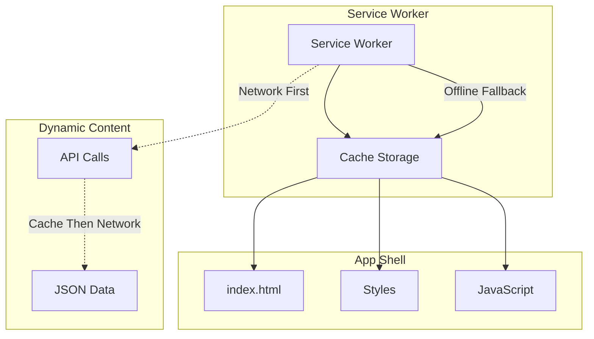

## 🎯 Componentes por Responsabilidade

### Frontend

- **UI Components**: HTML5, CSS3 (Vanilla, Dark Mode)
- **State Management**: JavaScript (sem framework)
- **Visualização**: Chart.js
- **PWA**: Service Worker, Manifest
- **Validação**: Client-side validators

### Backend

- **Framework**: FastAPI (Python)
- **ORM**: SQLAlchemy
- **Autenticação**: JWT (python-jose)
- **Validação**: Pydantic
- **Documentação**: OpenAPI/Swagger automático

### Infraestrutura

- **Web Server**: Nginx (reverse proxy)
- **App Server**: Uvicorn/Gunicorn
- **Database**: SQLite (ou PostgreSQL)
- **Process Manager**: Systemd
- **Scheduler**: Cron

### Observabilidade

- **Logs**: Python logging + Journald
- **Metrics**: Health check endpoint
- **Alerts**: Email service
- **Backup**: Automated daily
